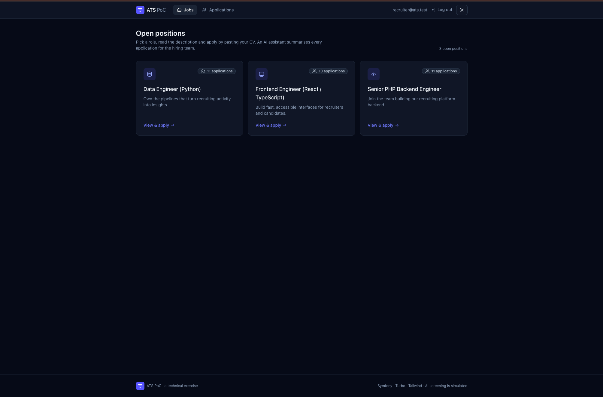
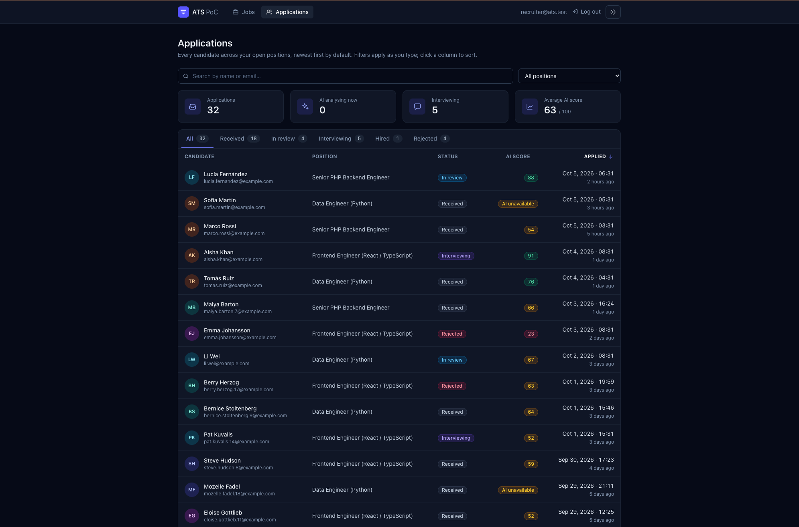

# ATS PoC

A minimal **Application Tracking System**: candidates apply to a job by pasting their CV as plain text, and an **asynchronous, mocked AI** enriches each application with a CV summary, a relevance score and a skill-by-skill match against the offer. Recruiters sign in to browse, filter and review applications.

Built with **Symfony 8.1 / PHP 8.4** following **DDD + Hexagonal architecture + CQRS / events**, with **RabbitMQ** for asynchronous processing.

| Open positions | Apply (dark mode) |
|---|---|
|  |  |
| **Applications (recruiter)** | **Application detail (dark mode)** |
|  |  |

## Quick start

Requirements: **Docker** (with Compose) and **GNU Make**. Nothing else needs to be installed on the host.

```bash
make init
```

It builds the image, starts the containers, installs dependencies, runs the migrations, loads demo data, builds the assets and starts the worker. Then:

| What | Where |
|---|---|
| Web app | http://localhost:8080 |
| Recruiter area | http://localhost:8080/applications — sign in with **recruiter@ats.test / recruiter** |
| RabbitMQ management | http://localhost:15672 — **guest / guest** |
| PostgreSQL | `localhost:5433`, database `app`, user **app / app** (tests use a separate `app_test` database) |

`make` lists every available command; `make down` stops everything. Day-to-day work (configuration, migrations, the worker, troubleshooting) is in the **[development guide](docs/DEVELOPMENT.md)**.

## Try it

1. **Apply** — open http://localhost:8080, pick a position, fill in your data and paste a CV. The application is stored immediately and you get a confirmation page.
2. **Watch the AI work** — click *Open in the recruiter area* and sign in. The application shows *Analysing…* while the worker processes it (the mocked LLM takes ~1.5 s on purpose); the page updates by itself with the **summary**, the **score** and which of the offer's skills the CV covers, next to the offer itself.
3. **Browse** — at `/applications`, type in the search box, pick a status tab or a position: results update as you type, newest first, with the score column. Click a column header to sort by it, page through the results and pick 10, 20 or 50 per page.
4. **Move it along the pipeline** — on the detail page, advance the application one step (`received → in_review → interviewing → hired`) or reject it. Only valid transitions are offered.
5. **See a failure handled** — apply with a CV that contains `[simulate-llm-failure]`: the worker retries 3 times with back-off and the application ends up *AI unavailable* instead of staying pending forever.
6. **Look behind the scenes** — `make logs` follows the worker; the RabbitMQ UI shows the `messages` queue; `docker compose exec app php bin/console messenger:failed:show` lists messages that exhausted their retries.

The demo data (`make fixtures`) contains three job offers and 32 applications in varied states (eight hand-written, 24 generated with a fixed seed), enough to page through the list.

## Tests and quality

```bash
make test   # all tests
make qa     # PHP-CS-Fixer (dry-run) + PHPStan level max + Deptrac
```

**231 tests** (148 unit, 83 integration), all run in Docker against a real PostgreSQL test database: business rules, SQL read models, contracts between contexts, a real Messenger worker, every page, and the whole journey from the apply form to the recruiter screens. **Deptrac** fails the build if the domain depends on the framework or one bounded context imports another; GitHub Actions runs `make init`, `make qa` and `make test` on every pull request. Each acceptance criterion of the brief and the tests that prove it: [Architecture → Testing strategy](docs/ARCHITECTURE.md#testing-strategy).

## Beyond the brief

Also added, because a real recruiting tool would need them: a recruiter area behind a login, abuse protection (rate limiting and login throttling), a hiring pipeline guarded by the domain, sorting and pagination, applications grouped by email, an overview with counts, and dark mode with keyboard and screen-reader support. None of them changes the required flows. What each one adds and why: [Architecture → Beyond the brief](docs/ARCHITECTURE.md#beyond-the-brief).

## Architecture in a nutshell

Two bounded contexts, **Recruitment** (job offers and applications) and **Screening** (AI analysis of CVs), each split into Domain (pure PHP rules), Application (use cases) and Infrastructure (Symfony, Doctrine, RabbitMQ, UI), plus a small shared kernel.

- **Dependencies point inwards**: the domain knows nothing about Symfony, Doctrine or RabbitMQ (verified by Deptrac).
- **CQRS**: commands change state inside a transaction, queries read straight into DTOs with SQL, events notify.
- **The contexts talk only through events over RabbitMQ**, as JSON identified by a stable event name; each consumer owns the class it reads them with.

```
submit ─▶ JobApplicationSubmitted ══RabbitMQ══▶ Screening (mock LLM) ══▶ CvScreened ──▶ application gets summary + score
```

Full explanation, diagrams and the comparison with a classic Symfony layout: **[docs/ARCHITECTURE.md](docs/ARCHITECTURE.md)** ([versión en español](docs/ARCHITECTURE.es.md)).

## Tech stack

| Area | Choice |
|---|---|
| Backend | PHP 8.4, Symfony 8.1, Doctrine ORM 3 (XML mapping), Symfony Messenger |
| Messaging | RabbitMQ (AMQP), dedicated worker container, Doctrine failure transport |
| Database | PostgreSQL 16 (`pg_trgm` for search) |
| UI | Twig + Twig Components, Symfony UX Turbo + Stimulus, Tailwind CSS 4 — no Node, no build step beyond `make init` |
| Auth & abuse | Symfony Security (recruiter area, login throttling), Symfony RateLimiter on the apply form |
| Tooling | PHPUnit 12, Foundry, dama/doctrine-test-bundle, PHPStan, PHP-CS-Fixer, Deptrac, GitHub Actions |
| Runtime | Docker Compose (FrankenPHP) |

## Documentation

- **[Architecture](docs/ARCHITECTURE.md)** ([español](docs/ARCHITECTURE.es.md)) — how the code is organised and why, flows, contracts, reliability, testing strategy, trade-offs.
- **[Development guide](docs/DEVELOPMENT.md)** ([español](docs/DEVELOPMENT.es.md)) — everyday commands, configuration, database changes, the asynchronous worker, troubleshooting.
- **[Deploying to production](docs/DEPLOYMENT.md)** ([español](docs/DEPLOYMENT.es.md)) — what a production deployment would need: build, secrets, release steps, workers, scaling.
- **[Work plan & decision log](docs/PLAN.md)** — the iterations this was built in and the reason behind every decision.

This project was built with an AI coding assistant under an explicit working agreement: the plan, coding standards and architecture rules it followed are versioned in [`CLAUDE.md`](CLAUDE.md) and [`.claude/`](.claude), and every decision was taken by the author and recorded in the decision log.

## Known limitations

Documented trade-offs, with what would change on the way to production, are listed in [Architecture → Trade-offs and next steps](docs/ARCHITECTURE.md#trade-offs-and-next-steps). The main ones:

- **Mocked LLM** (required by the brief): deterministic keyword-coverage scoring; a real model is a new `CvAnalyzer` adapter, nothing else changes.
- Events are published after the database commit but without a **transactional outbox**: if RabbitMQ is down at that exact moment, the event is lost.
- Search is case-insensitive but **not accent-insensitive**; emails with non-ASCII characters are rejected.
- A single **in-memory demo recruiter** account; candidates have no accounts.
