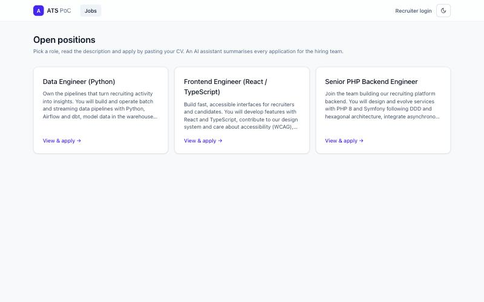
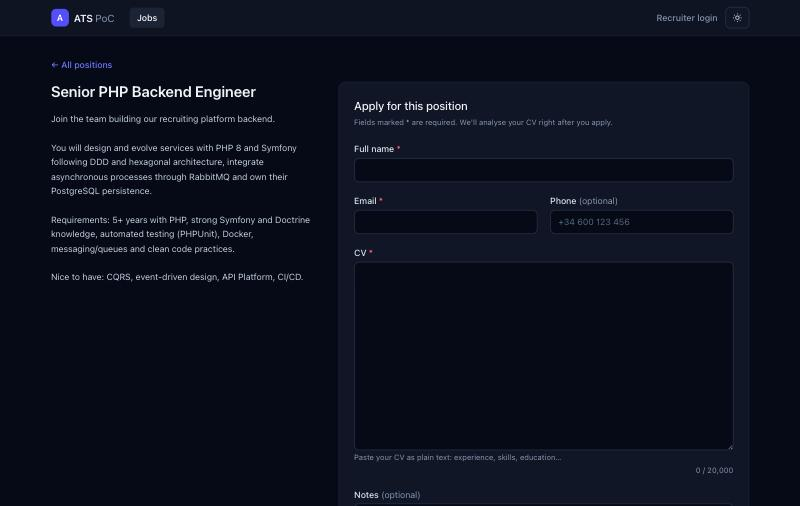
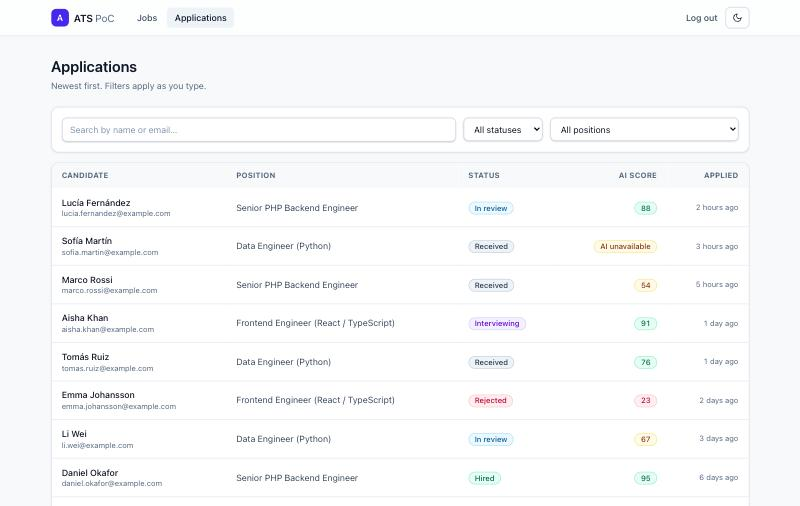
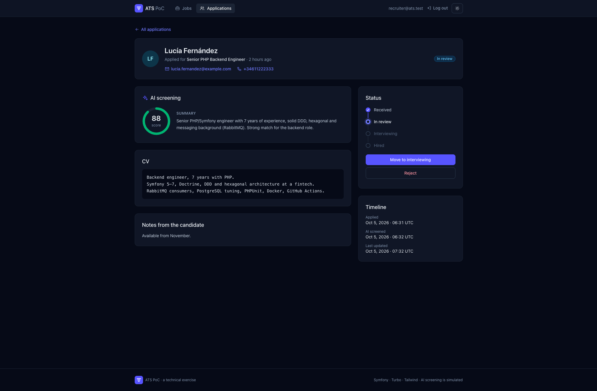

# ATS PoC

A minimal **Application Tracking System**: candidates apply to a job by pasting their CV as plain text, and an **asynchronous, mocked AI** enriches each application with a CV summary and a relevance score. Recruiters sign in to browse, filter and review applications.

Built with **Symfony 8.1 / PHP 8.4** following **DDD + Hexagonal architecture + CQRS / events**, with **RabbitMQ** for asynchronous processing.

| Open positions | Apply (dark mode) |
|---|---|
|  |  |
| **Applications (recruiter)** | **Application detail (dark mode)** |
|  |  |

## Quick start

Requirements: **Docker** (with Compose) and **GNU Make**. Nothing else needs to be installed on the host.

```bash
make init
```

It builds the image, starts the containers, installs dependencies, runs the migrations, loads demo data, builds the assets and starts the worker. Then:

| What | Where |
|---|---|
| Web app | http://localhost:8080 |
| Recruiter area | http://localhost:8080/applications — sign in with **recruiter@ats.test / recruiter** |
| RabbitMQ management | http://localhost:15672 — **guest / guest** |
| PostgreSQL | `localhost:5433`, database `app`, user **app / app** (tests use a separate `app_test` database) |

`make` lists every available command; `make down` stops everything. Day-to-day work (configuration, migrations, the worker, troubleshooting) is in the **[development guide](docs/DEVELOPMENT.md)**.

## Try it

1. **Apply** — open http://localhost:8080, pick a position, fill in your data and paste a CV. The application is stored immediately and you get a confirmation page.
2. **Watch the AI work** — click *Open in the recruiter area* and sign in. The application shows *Analysing…* while the worker processes it (the mocked LLM takes ~1.5 s on purpose); the page updates by itself with the **summary** and the **score**.
3. **Browse** — at `/applications`, type in the search box, pick a status tab or a position: results update as you type, newest first, with the score column. Click a column header to sort by it, page through the results and pick 10, 20 or 50 per page.
4. **Move it along the pipeline** — on the detail page, advance the application one step (`received → in_review → interviewing → hired`) or reject it. Only valid transitions are offered.
5. **See a failure handled** — apply with a CV that contains `[simulate-llm-failure]`: the worker retries 3 times with back-off and the application ends up *AI unavailable* instead of staying pending forever.
6. **Look behind the scenes** — `make logs` follows the worker; the RabbitMQ UI shows the `messages` queue; `docker compose exec app php bin/console messenger:failed:show` lists messages that exhausted their retries.

The demo data (`make fixtures`) contains three job offers and 32 applications in varied states (eight hand-written, 24 generated with a fixed seed), enough to page through the list.

## Tests and quality

```bash
make test   # all tests
make qa     # PHP-CS-Fixer (dry-run) + PHPStan level max + Deptrac
```

**215 tests**, all run in Docker against a real PostgreSQL test database:

| Level | Tests | What they prove |
|---|---|---|
| Unit | 134 | Business rules, use cases, mocked-LLM scoring, JSON serializer — no kernel, no database |
| Integration | 81 | Doctrine round-trips and SQL read models, the buses, contract tests between contexts, a real Messenger worker end to end, and functional tests of every page (incl. access control) |

**Quality gates**: PHPStan at level max, PHP-CS-Fixer (`@Symfony`), and **Deptrac**, which fails the build if the domain depends on the framework or if one bounded context imports another. GitHub Actions runs `make init`, `make qa` and `make test` on every pull request.

### Acceptance criteria → tests

| Acceptance criterion | Proven by |
|---|---|
| Submitting an application creates a record with `appliedAt` and the default status | `ApplyToJobOfferTest::test_submitting_stores_a_received_application_and_queues_the_ai_enrichment`, `SubmitJobApplicationHandlerTest::test_it_stores_a_received_application_applied_now`, `JobApplicationTest::test_a_submitted_application_is_received_with_its_applied_at_date` |
| Asynchronous enrichment adds summary and score to that application | `AsyncEnrichmentTest::test_a_submitted_application_is_pending_until_the_worker_enriches_it` (real worker), `CompleteJobApplicationScreeningTest`, `EventContractsTest` |
| …including when the AI fails (retries, then a clear final state) | `AsyncEnrichmentTest::test_when_the_llm_keeps_failing_the_message_is_retried_then_the_screening_is_marked_as_failed` |
| The list is newest first | `SearchJobApplicationsTest::test_applications_are_listed_newest_first`, `BrowseJobApplicationsTest::test_the_list_is_newest_first_with_status_and_ai_score` |
| Real-time filtering by status and position, and search by name or email | `SearchJobApplicationsTest` (each filter, search, combined filters), `BrowseJobApplicationsTest::test_it_filters_by_status_and_position_and_searches_by_name_or_email`, `…::test_live_filtering_only_renders_the_results_frame` |
| The detail view shows all data, including the enrichment outputs | `JobApplicationDetailTest::test_it_shows_candidate_data_cv_ai_outputs_status_and_timestamps`, `FindJobApplicationTest::test_the_detail_shows_candidate_data_cv_enrichment_status_and_timestamps` |
| The score is visible in the list | `SearchJobApplicationsTest::test_the_list_shows_the_ai_score_once_screened`, `BrowseJobApplicationsTest::test_the_list_is_newest_first_with_status_and_ai_score` |

## Beyond the brief

Not asked for, added because a real recruiting tool would need them. None of them changes how the required flows work.

| Extra | What it adds |
|---|---|
| **Recruiter area behind a login** | Candidates apply without an account; listing and reviewing applications requires signing in. |
| **Abuse protection** | The apply form accepts 5 valid applications per IP every 15 minutes (`APPLY_RATE_LIMIT`; raise it in `.env.local` for heavy manual testing), answering `429` beyond that; the login allows 5 failed attempts per minute. |
| **Resilient AI enrichment** | A failing (mocked) LLM is retried 3 times with back-off; then the application shows *AI unavailable* instead of staying pending forever. |
| **Hiring pipeline** | Statuses with transitions guarded by the domain: one click to advance, an inline confirmation to reject, a stepper showing the stage. |
| **Applications grouped by email** | Each row shows how many applications came from its email (linking to all of them) and the detail page lists the others. Grouped on the read side only, because the email isn't verified: [why](docs/ARCHITECTURE.md#beyond-the-brief). |
| **Overview** | Totals, ongoing analyses, interviews and average score; status tabs with counts; applications per offer for recruiters. |
| **Sorting and pagination** | Click any column to sort (status in pipeline order, unscored applications last); first/previous/numbered/next/last pages and a page size. All of it in the URL, combined with the filters. |
| **UI quality** | Dark mode, keyboard and screen-reader friendly, toasts, works without JavaScript (filters fall back to a plain form). |
| **Enforced architecture** | Deptrac, PHPStan level max and CI on every pull request. |

The reasons behind each one are in the [decision log](docs/PLAN.md); abuse protection and the email grouping are described in [Architecture → Beyond the brief](docs/ARCHITECTURE.md#beyond-the-brief).

## Architecture in a nutshell

```
src/
├── Recruitment/   job offers & applications   ─┐  each one: Domain (pure PHP rules)
├── Screening/     AI analysis of CVs          ─┤            Application (use cases)
└── Shared/        shared kernel, buses, login ─┘            Infrastructure (Symfony, Doctrine, RabbitMQ, UI)
```

- **Dependencies point inwards**: the domain knows nothing about Symfony, Doctrine or RabbitMQ (verified by Deptrac).
- **CQRS**: commands change state inside a transaction, queries read straight into DTOs with SQL, events notify.
- **Two bounded contexts talk only through events over RabbitMQ**, as JSON identified by a stable event name; each consumer owns the class it reads them with.

```
submit ─▶ JobApplicationSubmitted ══RabbitMQ══▶ Screening (mock LLM) ══▶ CvScreened ──▶ application gets summary + score
```

Full explanation, diagrams and the comparison with a classic Symfony layout: **[docs/ARCHITECTURE.md](docs/ARCHITECTURE.md)** ([versión en español](docs/ARCHITECTURE.es.md)).

## Tech stack

| Area | Choice |
|---|---|
| Backend | PHP 8.4, Symfony 8.1, Doctrine ORM 3 (XML mapping), Symfony Messenger |
| Messaging | RabbitMQ (AMQP), dedicated worker container, Doctrine failure transport |
| Database | PostgreSQL 16 (`pg_trgm` for search) |
| UI | Twig + Twig Components, Symfony UX Turbo + Stimulus, Tailwind CSS 4 — no Node, no build step beyond `make init` |
| Auth & abuse | Symfony Security (recruiter area, login throttling), Symfony RateLimiter on the apply form |
| Tooling | PHPUnit 12, Foundry, dama/doctrine-test-bundle, PHPStan, PHP-CS-Fixer, Deptrac, GitHub Actions |
| Runtime | Docker Compose (FrankenPHP) |

## Documentation

- **[Architecture](docs/ARCHITECTURE.md)** ([español](docs/ARCHITECTURE.es.md)) — how the code is organised and why, flows, contracts, reliability, testing strategy, trade-offs.
- **[Development guide](docs/DEVELOPMENT.md)** ([español](docs/DEVELOPMENT.es.md)) — everyday commands, configuration, database changes, the asynchronous worker, troubleshooting.
- **[Deploying to production](docs/DEPLOYMENT.md)** ([español](docs/DEPLOYMENT.es.md)) — what a production deployment would need: build, secrets, release steps, workers, scaling.
- **[Work plan & decision log](docs/PLAN.md)** — the iterations this was built in and the reason behind every decision.

This project was built with an AI coding assistant under an explicit working agreement: the plan, coding standards and architecture rules it followed are versioned in [`CLAUDE.md`](CLAUDE.md) and [`.claude/`](.claude), and every decision was taken by the author and recorded in the decision log.

## Known limitations

Documented trade-offs, with what would change on the way to production, are listed in [Architecture → Trade-offs and next steps](docs/ARCHITECTURE.md#trade-offs-and-next-steps). The main ones:

- **Mocked LLM** (required by the brief): deterministic keyword-coverage scoring; a real model is a new `CvAnalyzer` adapter, nothing else changes.
- Events are published after the database commit but without a **transactional outbox**: if RabbitMQ is down at that exact moment, the event is lost.
- Search is case-insensitive but **not accent-insensitive**; emails with non-ASCII characters are rejected.
- A single **in-memory demo recruiter** account; candidates have no accounts.
