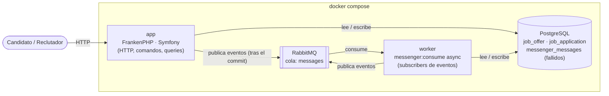
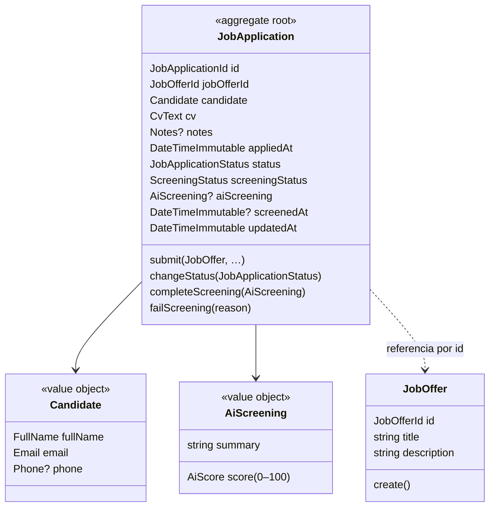
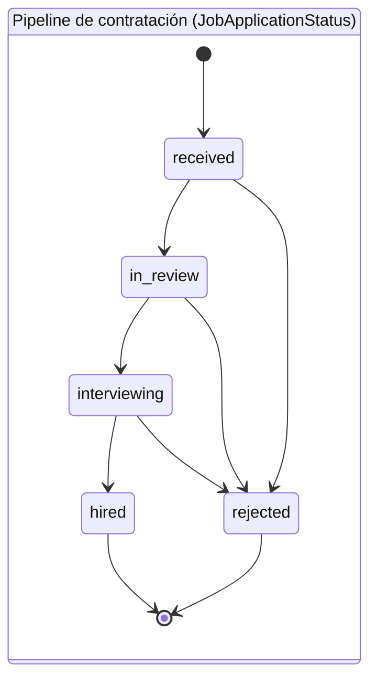
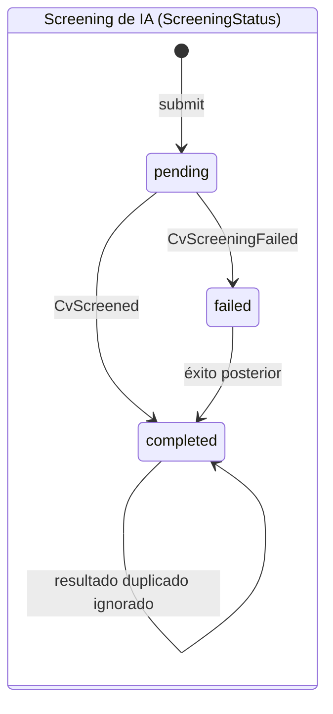
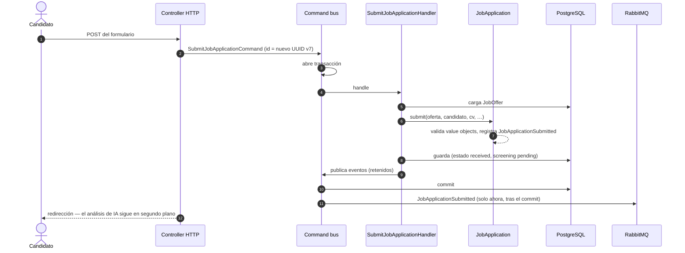
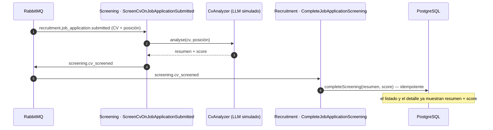
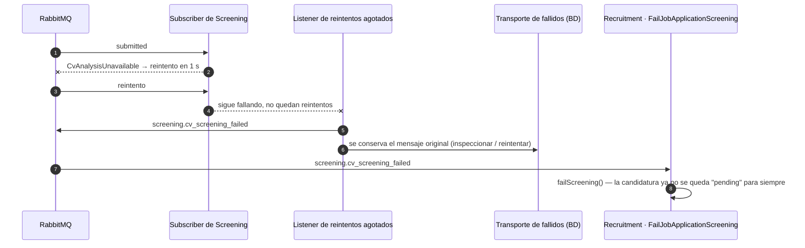
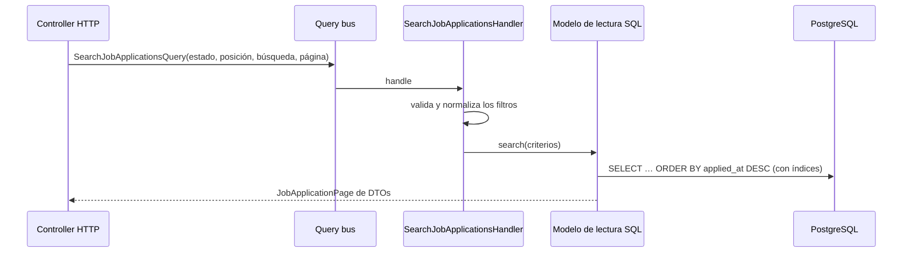

# Arquitectura

🇬🇧 [English version](ARCHITECTURE.md)

Este documento explica **cómo está organizada la aplicación y por qué**, en comparación con la estructura clásica de Symfony (`Controller/`, `Entity/`, `Repository/`, `Service/`), y ofrece un mapa general del sistema: piezas en ejecución, modelo de dominio, casos de uso y los flujos entre ellos. El razonamiento de cada decisión concreta está en el [registro de decisiones](PLAN.md#decision-log) (en inglés).

## Índice

1. [La idea en una frase](#la-idea-en-una-frase)
2. [Visión general del sistema](#visión-general-del-sistema)
3. [Estructura de carpetas](#estructura-de-carpetas)
4. [Symfony clásico → este proyecto](#symfony-clásico--este-proyecto)
5. [Bounded contexts](#bounded-contexts)
6. [Modelo de dominio](#modelo-de-dominio)
7. [Casos de uso (CQRS)](#casos-de-uso-cqrs)
8. [Flujos](#flujos)
9. [Contratos entre contextos](#contratos-entre-contextos)
10. [Fiabilidad](#fiabilidad)
11. [Persistencia](#persistencia)
12. [Estrategia de tests](#estrategia-de-tests)
13. [Verificado, no solo dibujado](#verificado-no-solo-dibujado)
14. [Trade-offs y próximos pasos](#trade-offs-y-próximos-pasos)

## La idea en una frase

En una aplicación Symfony clásica **el framework está en el centro** y las reglas de negocio están repartidas dentro de él (atributos del ORM en las entidades, servicios que usan el `EntityManager`, atributos de validación en las entidades). Aquí se invierte: **las reglas de negocio están en el centro, en PHP puro, y Symfony, Doctrine y RabbitMQ son enchufes en el borde**.

La regla que lo sostiene todo: **las dependencias solo apuntan hacia dentro**. El dominio no sabe que Symfony existe; Symfony sí conoce el dominio. Deptrac lo verifica automáticamente (`make deptrac`), así que es una garantía, no una convención.

```
┌──────────────────── Infrastructure ────────────────────┐
│  Controllers HTTP, Doctrine, RabbitMQ, Twig, mock IA    │
│    ┌─────────────── Application ───────────────┐        │
│    │  Casos de uso: SubmitJobApplication, …    │        │
│    │    ┌───────────── Domain ─────────────┐   │        │
│    │    │  JobApplication, Email, reglas … │   │        │
│    │    └──────────────────────────────────┘   │        │
│    └───────────────────────────────────────────┘        │
└─────────────────────────────────────────────────────────┘
            las dependencias apuntan → hacia dentro
```

## Visión general del sistema

Cuatro contenedores y un único código. La app web y el worker usan **la misma imagen**: la app responde peticiones HTTP y el worker consume mensajes de RabbitMQ. Todo lo lento (el enriquecimiento con IA) ocurre en el worker, nunca dentro de una petición.

Dos públicos: los **candidatos** usan las páginas públicas (ofertas y envío) sin cuenta; los **reclutadores** inician sesión para ver y gestionar las candidaturas. La autenticación se resuelve entera en el borde (Symfony Security): el dominio y los casos de uso no saben nada de usuarios.



## Estructura de carpetas

```
src/
├── Recruitment/                        bounded context: ofertas y candidaturas
│   ├── Domain/                         PHP puro: reglas y estado
│   │   ├── JobApplication/             agregado, value objects, estados, eventos, puerto del repositorio
│   │   │   ├── Candidate/              FullName, Email, Phone, Candidate
│   │   │   └── Event/                  JobApplicationSubmitted, …Screened, …StatusChanged, …
│   │   └── JobOffer/                   JobOffer, JobOfferId, puerto del repositorio
│   ├── Application/                    una carpeta por caso de uso (comando/query + handler)
│   │   ├── SubmitJobApplication/
│   │   ├── ChangeJobApplicationStatus/
│   │   ├── CompleteJobApplicationScreening/   ← reacciona al resultado de Screening
│   │   ├── FailJobApplicationScreening/       ← reacciona al fallo de Screening
│   │   ├── SearchJobApplications/             ← lado de lectura
│   │   ├── FindJobApplication/                ← lado de lectura
│   │   ├── ListJobOffers/                     ← lado de lectura
│   │   └── JobApplicationReadModel.php        puerto del lado de lectura
│   └── Infrastructure/
│       ├── Http/                       controllers invocables, formulario de envío + DTO de la petición
│       ├── Persistence/Doctrine/       repositorios, mapping XML, tipos DBAL, listeners de esquema
│       ├── Persistence/Dbal/           modelos de lectura en SQL (lado de queries)
│       └── Fixtures/                   datos de demo
├── Screening/                          bounded context: enriquecimiento de CVs con IA
│   ├── Domain/                         puerto CvAnalyzer, CvAnalysis, Position, eventos
│   ├── Application/ScreenCv/           subscriber + su propia versión del evento de Recruitment
│   └── Infrastructure/
│       ├── Ai/                         FakeLlmCvAnalyzer (LLM simulado)
│       └── Messenger/                  listener de "reintentos agotados"
└── Shared/                             lo mínimo común a todos
    ├── Domain/                         AggregateRoot, DomainEvent, DomainError, Uuid, puertos de los buses
    └── Infrastructure/                 adaptadores de buses sobre Messenger, serializador JSON de eventos, helpers DBAL, login
```

### Domain: el núcleo

Reglas de negocio y nada más: un email debe ser válido, una candidatura no puede saltar de `received` a `hired`, un resultado de IA repetido se ignora. Ni un `use Symfony\…` ni un `use Doctrine\…`.

*Por qué:* las reglas son la parte más valiosa y la que más tiempo vive. En PHP puro se testean en milisegundos sin arrancar el kernel ni la base de datos, y las actualizaciones del framework no las tocan (este proyecto pasó de Symfony 7.4 a 8.1 sin cambiar una sola línea del dominio).

### Application: los casos de uso

Cada cosa que el sistema sabe hacer es un par de clases: un comando o query (los datos de entrada) y su handler (la orquestación). Los handlers no contienen reglas de negocio: cargan o crean agregados, llaman a su comportamiento, los guardan y publican sus eventos.

*Por qué:* como los `Service` clásicos, pero con una única responsabilidad cada uno y con nombre de negocio. Leyendo la carpeta se sabe qué hace la aplicación. Los handlers implementan interfaces propias, no las de Messenger, así que los casos de uso tampoco dependen del framework.

### Infrastructure: los adaptadores

Todo lo que depende de tecnología: controllers HTTP, repositorios de Doctrine y mapping XML, modelos de lectura en SQL, serialización de mensajes, el mock de IA, los fixtures y las plantillas.

*Por qué:* cambiar PostgreSQL, RabbitMQ o el proveedor de IA solo afecta a esta carpeta.

## Symfony clásico → este proyecto

| Symfony clásico | Aquí | Qué cambia |
|---|---|---|
| `Entity/JobApplication.php` con `#[ORM\Column]` | `Domain/…/JobApplication.php` + mapping XML en `Infrastructure/Persistence/Doctrine/Mapping` | Sigue siendo Doctrine: la metadata simplemente sale de la clase, y la entidad queda limpia. |
| `Repository/…Repository extends ServiceEntityRepository` | Interfaz en `Domain` + `Doctrine…Repository` en `Infrastructure` | El dominio declara *qué* necesita (un **puerto**) y la infraestructura decide *cómo* (un **adaptador**): de ahí "ports & adapters". |
| `#[Assert\Email]` en la entidad | Value object `Email::fromString()` (más validación en el formulario/DTO del borde) | La regla viaja con el dato: no puede existir un `Email` inválido en ningún sitio. |
| `$entity->setStatus('hired')` | `$application->changeStatus(JobApplicationStatus::Hired, $now)` | Sin setters: solo métodos con nombre de negocio que protegen las reglas. El estado se puede leer (`public private(set)`) pero no modificar desde fuera. |
| `Service/ApplicationService.php` | `Application/SubmitJobApplication/…Handler.php` | Un caso de uso por clase. |
| Método de repositorio que devuelve entidades para un listado | Query `SearchJobApplications` + modelo de lectura SQL que devuelve DTOs | Las lecturas se saltan por completo el modelo de dominio. |
| `EventSubscriber` / `MessageHandler` con `#[AsMessageHandler]` | Clase que implementa `DomainEventSubscriber`, conectada en `services.yaml` | Por debajo es el mismo Messenger; el caso de uso simplemente no lo sabe. |
| `Controller/` | `Infrastructure/Http/` | Traduce HTTP → comando/query, nada más. |
| State Processor / Provider de API Platform | Handler de comando / handler de query | La misma idea: los processors y providers de API Platform ya son adaptadores alrededor de un caso de uso. |

## Bounded contexts

`Recruitment` (candidaturas, pipeline de contratación) y `Screening` (analizar un CV con IA) hablan idiomas distintos y cambian por motivos distintos. Si uno importara clases del otro acabarían siendo un único bloque acoplado, así que **solo se comunican mediante eventos a través de RabbitMQ**, y Deptrac falla si alguno importa al otro.

| Contexto | Es dueño de | Publica | Consume |
|---|---|---|---|
| **Recruitment** | Ofertas, candidaturas (candidato, CV, estado de contratación, resultado de la IA cuando llega) | `recruitment.job_application.submitted` | `screening.cv_screened`, `screening.cv_screening_failed` |
| **Screening** | Nada persistente: analiza un CV frente a una posición a través de un puerto de IA | `screening.cv_screened`, `screening.cv_screening_failed` | `recruitment.job_application.submitted` |
| **Shared** | Solo el shared kernel: clases base de agregados y eventos, `Uuid`, interfaces de los buses | — | — |

Screening **no guarda estado** a propósito: el resultado que produce pertenece a la candidatura, así que se almacena una sola vez, en Recruitment.

## Modelo de dominio



Una candidatura vive dos ciclos de vida **independientes**: el pipeline de contratación, que mueven los reclutadores, y el screening de la IA, que avanza con el enriquecimiento asíncrono. Un reclutador puede pasar una candidatura a `in_review` antes de que la IA haya respondido.





Reglas que protege el agregado: las transiciones solo siguen el pipeline (los estados finales son finales); un resultado de screening repetido se ignora; un fallo que llega tarde nunca sobrescribe un screening completado. Cada cambio registra un evento de dominio.

## Casos de uso (CQRS)

Los **comandos** cambian el estado y no devuelven nada; las **queries** devuelven datos y no cambian nada. Viajan por buses separados porque su semántica es distinta: los comandos se ejecutan dentro de una transacción de base de datos, las queries pueden saltarse el modelo de dominio y los eventos pueden tener cero o muchos subscribers.

| Tipo | Caso de uso | Lo dispara | Resultado |
|---|---|---|---|
| Comando | `SubmitJobApplication` | Candidato (formulario de envío) | Candidatura `received`, screening `pending`, `JobApplicationSubmitted` |
| Comando | `ChangeJobApplicationStatus` | Reclutador | Estado avanzado en el pipeline, `JobApplicationStatusChanged` |
| Comando | `CompleteJobApplicationScreening` | Evento `cv_screened` de Screening | Resumen + score asociados, `JobApplicationScreened` |
| Comando | `FailJobApplicationScreening` | Evento `cv_screening_failed` de Screening | Screening `failed`, `JobApplicationScreeningFailed` |
| Subscriber | `ScreenCvOnJobApplicationSubmitted` (Screening) | Evento `submitted` de Recruitment | Llama al puerto de IA y publica `CvScreened` |
| Query | `SearchJobApplications` | Página de candidaturas | Página de filas: más recientes primero, filtradas por estado / posición, búsqueda por nombre / email |
| Query | `FindJobApplication` | Página de detalle | Todo, incluidos el CV, los resultados de la IA, las fechas y los siguientes estados permitidos |
| Query | `ListJobOffers` | Página de envío, filtro por posición | Catálogo de ofertas |

Recruitment reacciona a los eventos de Screening **traduciéndolos a comandos propios**: así el cambio pasa por el command bus como cualquier otra escritura (transacción, reglas de negocio, eventos).

## Flujos

### Enviar una candidatura (parte síncrona)



### Enriquecimiento con IA (asíncrono, en el worker)



### Cuando la IA sigue fallando



### Lectura (lado de queries)



En el lado de lectura no se carga ningún agregado: al leer no hay reglas que proteger, así que SQL directo a DTOs planos es más simple y más rápido.

## Contratos entre contextos

Los eventos que cruzan la frontera entre contextos viajan como **JSON** y se identifican por un **nombre de evento estable**. Ese nombre más el payload es el contrato, no una clase PHP.

```
headers: type: recruitment.job_application.submitted
body:    {"aggregateId": "…", "occurredOn": "…", "payload": {"jobOfferId": "…", "positionTitle": "…", "positionDescription": "…", "cv": "…"}}
```

- El **publicador** serializa su propia clase de evento.
- **Cada consumidor tiene su propia clase** para los eventos que lee, solo con los campos que necesita (el `JobApplicationSubmitted` de Screening ignora `jobOfferId`). La correspondencia *nombre de evento → clase del consumidor* es configuración explícita, así que el mapa de integración del sistema se lee en un solo sitio.
- **Tests de contrato guiados por el consumidor**: envían cada evento publicado por el serializador real y comprueban que la clase del consumidor lo reconstruye. Un campo renombrado hace fallar un test, no producción.
- Solo los eventos que cruzan una frontera se envían a RabbitMQ; el resto se quedan dentro del proceso.
- **Event-carried state transfer**: `JobApplicationSubmitted` lleva el CV y la posición, así que Screening nunca tiene que consultar a Recruitment.

## Fiabilidad

| Riesgo | Cómo se cubre |
|---|---|
| Reaccionar a datos que se han revertido | Los eventos se retienen hasta que la transacción del comando hace commit. |
| Entrega duplicada (RabbitMQ entrega *al menos una vez*) | El agregado es idempotente: un resultado repetido o un fallo tardío no cambian nada. |
| Fallos transitorios de la IA | Messenger reintenta 3 veces con backoff exponencial (1 s, 2 s, 4 s). |
| Fallos permanentes de la IA | Al agotarse los reintentos se publica el hecho `CvScreeningFailed` y el mensaje original se conserva en el transporte de fallidos (`messenger:failed:show` / `retry`). |
| Mensaje desconocido o mal formado | La decodificación falla de forma explícita en lugar de procesar un evento a medio leer. |
| Broker caído justo después de un commit | **No está cubierto** (trade-off conocido): el evento se perdería. Un *transactional outbox* cerraría este hueco. |

## Persistencia

- **Mapping en XML** dentro de Infrastructure, para que las entidades no lleven atributos del ORM (Doctrine ORM 3 eliminó el mapping en YAML).
- **Los value objects** se convierten en columnas mediante tipos DBAL propios (`Email`, `FullName`, ids…); `Candidate` y `AiScreening` son embeddables (columnas `candidate_*` y `ai_*`). Doctrine no sabe expresar un embeddable *nulo*, así que un pequeño listener `postLoad` convierte un `AiScreening` con todo a NULL de nuevo en `null`.
- **Los agregados se referencian por id** (una candidatura guarda `jobOfferId`, no una asociación de Doctrine), así que no hay foreign key entre ellos; la integridad la comprueba el caso de uso.
- **Índices** para el listado: `(applied_at, id)` para el orden de más reciente a más antigua, `status` y `job_offer_id` para los filtros, e índices GIN `pg_trgm` para la búsqueda "contiene" por nombre o email. Los índices GIN se declaran a Doctrine con un listener de esquema, para que las migraciones nunca intenten borrarlos.
- **Los ids son UUID v7**: los genera quien lanza el comando (los comandos no devuelven nada) y están ordenados por tiempo de forma natural.

## Estrategia de tests

| Nivel | Qué demuestra | Cómo |
|---|---|---|
| Unitario | Reglas de negocio, orquestación de los casos de uso, puntuación del LLM simulado, serializador | PHPUnit puro, Object Mothers, repositorios en memoria, buses espía. Sin kernel ni BD: milisegundos. |
| Integración | Los adaptadores funcionan de verdad: ida y vuelta con Doctrine, modelos de lectura SQL, índices, buses | Base de datos PostgreSQL de test; cada test se revierte (dama/doctrine-test-bundle); datos creados con Foundry a través del comportamiento del dominio. |
| Contrato | Cada consumidor entiende lo que envía cada publicador | Serializador JSON real: entra la clase del publicador, sale la del consumidor. |
| Asíncrono de punta a punta | Envío → Screening → resultado, incluidos los reintentos y el camino de fallo | Un `Worker` real de Messenger sobre el transporte en memoria con serialización activada. |

Cada criterio de aceptación del enunciado (envío, enriquecimiento, listado de más reciente a más antigua con filtros y búsqueda, detalle) tiene al menos un test de integración o de punta a punta.

## Verificado, no solo dibujado

| Regla | La comprueba |
|---|---|
| El dominio no depende del framework ni del ORM | Deptrac |
| Application no depende del framework | Deptrac |
| Los contextos nunca se importan entre sí | Deptrac |
| Los tipos son correctos | PHPStan (nivel max) |
| Estándar de código | PHP-CS-Fixer (`@Symfony`) |
| Las reglas de negocio se comportan como se especifica | Tests unitarios (sin kernel ni BD) |
| Los adaptadores funcionan con PostgreSQL / Messenger reales | Tests de integración |
| Los contextos siguen entendiendo los eventos del otro | Tests de contrato |
| El área de reclutador exige iniciar sesión; las páginas del candidato siguen públicas | Tests funcionales |
| Todo lo anterior en cada pull request | GitHub Actions (`make qa`, `make test` dentro de Docker) |

## Trade-offs y próximos pasos

La arquitectura hexagonal no sale gratis: más ficheros, más indirección y algo de mapeo entre capas. Para un CRUD sencillo, un enfoque clásico con Symfony y API Platform es más productivo. Compensa cuando las reglas de negocio son ricas, el código tiene que vivir muchos años o, como aquí, hay flujos asíncronos entre partes separadas del dominio que necesitan fronteras claras.

Qué cambiaría de cara a producción:

- **Transactional outbox**, para no perder ningún evento si el broker cae justo después de un commit.
- **Un adaptador de LLM real** que implemente `CvAnalyzer` (prompts, parseo de la salida JSON, timeouts, límites de uso). Nada más cambia.
- **Una tabla de proyección** para el listado si algún día lecturas y escrituras necesitan escalar por separado.
- **Búsqueda insensible a tildes** (`unaccent`) y paginación keyset para tablas muy grandes.
- **Un almacén de usuarios real** (tabla de usuarios o SSO) en lugar de la cuenta de reclutador de demo en memoria.
