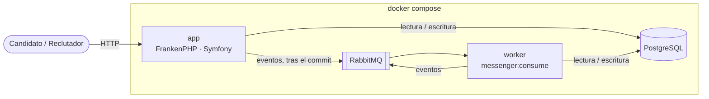
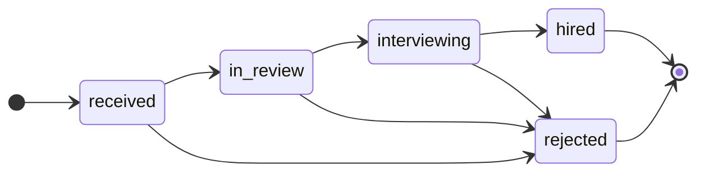
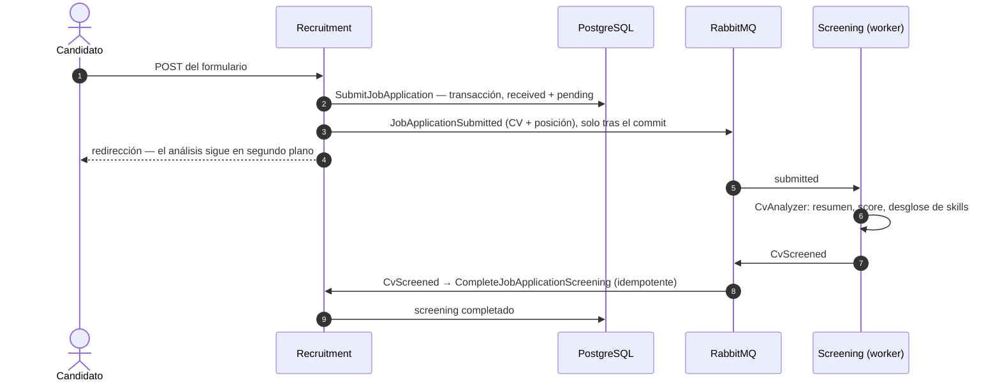

# Arquitectura

🇬🇧 [English version](ARCHITECTURE.md)

Cómo está organizada la aplicación y por qué. El motivo de cada decisión concreta está en el [registro de decisiones](PLAN.md#decision-log) (en inglés).

## Índice

1. [Visión general](#visión-general)
2. [Capas y contextos](#capas-y-contextos)
3. [Dominio](#dominio)
4. [Flujo principal](#flujo-principal)
5. [Eventos y fiabilidad](#eventos-y-fiabilidad)
6. [Estrategia de tests](#estrategia-de-tests)
7. [Más allá del enunciado](#más-allá-del-enunciado)
8. [Trade-offs y próximos pasos](#trade-offs-y-próximos-pasos)

## Visión general

En una app Symfony clásica el framework está en el centro y las reglas de negocio se reparten dentro de él. Aquí es al revés: **las reglas de negocio están en el centro, en PHP puro, y Symfony, Doctrine y RabbitMQ son enchufes en el borde**. Las dependencias solo apuntan hacia dentro, y **Deptrac** rompe la build si no; PHPStan (nivel max), PHP-CS-Fixer y los tests se ejecutan en la CI en cada pull request.

Cuatro contenedores, un solo código. La app y el worker usan la **misma imagen**: la app atiende HTTP y el worker consume RabbitMQ, así que nada lento (el enriquecimiento con IA) se ejecuta dentro de una petición. Los candidatos usan las páginas públicas sin cuenta; los reclutadores inician sesión (Symfony Security, entero en el borde).



## Capas y contextos

```
src/
├── Recruitment/   ofertas y candidaturas
│   ├── Domain/          agregado, value objects, eventos, puertos de repositorio — PHP puro
│   ├── Application/     una carpeta por caso de uso: comando o query + handler
│   └── Infrastructure/  controllers, Doctrine (mapping XML), modelos de lectura SQL, fixtures
├── Screening/     análisis de CVs con IA: el puerto CvAnalyzer y un LLM simulado
└── Shared/        shared kernel mínimo: clases base, Uuid, paginación, interfaces de los buses, login
```

- **Domain**: las reglas, sin ningún `use Symfony\…` ni `use Doctrine\…`, testeadas en milisegundos. La actualización de Symfony 7.4 a 8.1 no lo tocó.
- **Application**: cada caso de uso orquesta (cargar, llamar al agregado, guardar, publicar) y no contiene reglas. Los handlers implementan interfaces propias, no las de Messenger.
- **Infrastructure**: todo lo específico de una tecnología; cambiar PostgreSQL, RabbitMQ o el proveedor de IA solo toca esta capa.

| Contexto | Es dueño de | Publica | Consume |
|---|---|---|---|
| **Recruitment** | Ofertas y candidaturas (candidato, CV, estado de contratación, resultados de la IA) | `job_application.submitted` | `cv_screened`, `cv_screening_failed` |
| **Screening** | Nada persistente: analizar un CV contra una posición | `cv_screened`, `cv_screening_failed` | `job_application.submitted` |

Los contextos nunca importan clases del otro; solo se hablan por eventos. Screening no guarda estado: su resultado pertenece a la candidatura, así que se guarda una sola vez, en Recruitment.

| Symfony clásico | Aquí |
|---|---|
| Entidad con `#[ORM\Column]` | Clase limpia + mapping XML en Infrastructure |
| `ServiceEntityRepository` | Interfaz en Domain (puerto) + implementación con Doctrine (adaptador) |
| `#[Assert\Email]` en la entidad | Value object `Email`: uno inválido no puede existir (los formularios siguen validando en el borde) |
| `setStatus('hired')` | `changeStatus(Hired, $now)`: solo métodos de negocio; el estado se lee desde fuera pero no se escribe |
| Clase Service | Un handler por caso de uso; las lecturas van por SQL directo a DTOs |

## Dominio

`JobApplication` es el agregado. Vive dos ciclos de vida independientes: el **pipeline de contratación**, que mueven los reclutadores, y el **screening de la IA** (`pending → completed | failed`), que mueve el worker. Un reclutador puede mover una candidatura antes de que la IA responda.



- Las transiciones solo siguen el pipeline; `hired` y `rejected` son finales.
- **Screening idempotente**: un resultado repetido se ignora y un fallo tardío nunca pisa uno completado (los mensajes pueden llegar dos veces).
- Cada cambio registra un evento de dominio; el handler los publica.
- Persistencia: los value objects se mapean a columnas con tipos DBAL propios, `Candidate` y `AiScreening` son embeddables (el desglose de skills de la IA es una columna JSON), los agregados se referencian por id y los ids son UUID v7 que elige quien lanza el comando.

## Flujo principal



Recruitment convierte los eventos de Screening en comandos propios, así que toda escritura pasa por el mismo camino (transacción, reglas, eventos). Si la IA sigue fallando, Messenger reintenta 3 veces y después `CvScreeningFailed` marca el screening como fallido. Las páginas leen por SQL directo a DTOs, sin cargar agregados; el detalle hace polling solo mientras el análisis está pendiente.

## Eventos y fiabilidad

- Los eventos que cruzan de contexto viajan como **JSON identificado por un nombre estable** (`screening.cv_screened`); ese nombre y el payload son el contrato, no una clase PHP.
- **Cada consumidor tiene su propia clase**, solo con los campos que necesita; un mapa en `services.yaml` dice qué clase lee cada evento.
- **Tests de contrato**: cada evento pasa por el serializador real; un campo renombrado hace fallar un test, no producción.
- **Los contratos evolucionan de forma aditiva**: `cv_screened` ganó `skills`, y un evento sin ese campo se sigue leyendo como "sin desglose".
- **El evento lleva los datos**: `JobApplicationSubmitted` incluye el CV y la posición, así que Screening nunca consulta a Recruitment.

| Riesgo | Cómo se trata |
|---|---|
| Reaccionar a datos revertidos | Los eventos esperan al commit de la transacción del comando |
| Entrega duplicada (al menos una vez) | El agregado ignora los resultados repetidos |
| Fallo transitorio de la IA | 3 reintentos con backoff (1, 2, 4 s) |
| Fallo permanente de la IA | Se publica `CvScreeningFailed`; el mensaje queda en el transporte de fallidos para inspeccionarlo o reintentarlo |
| Broker caído justo tras un commit | **No cubierto**: el evento se perdería (ver el outbox más abajo) |

## Estrategia de tests

| Nivel | Qué demuestra |
|---|---|
| Unitario | Reglas de negocio, casos de uso (repositorios en memoria, buses espía), puntuación del LLM simulado — sin kernel ni base de datos |
| Integración | Doctrine y modelos de lectura SQL contra PostgreSQL real, cada test revertido |
| Contrato | Cada consumidor entiende lo que envía cada publicador |
| Asíncrono | Un worker real de Messenger: enriquecimiento, reintentos y camino de fallo |
| Funcional | Cada pantalla por HTTP, el control de acceso y el recorrido completo del formulario a las pantallas del reclutador |

| Criterio de aceptación | Lo demuestra |
|---|---|
| Enviar crea un registro con `appliedAt` y el estado por defecto | `ApplyToJobOfferTest`, `SubmitJobApplicationHandlerTest`, `JobApplicationTest` |
| El enriquecimiento asíncrono añade resumen y score | `AsyncEnrichmentTest`, `ApplicationJourneyTest`, `EventContractsTest` |
| …también cuando la IA falla | `AsyncEnrichmentTest` |
| El listado va de más reciente a más antigua, con el score | `SearchJobApplicationsTest`, `BrowseJobApplicationsTest` |
| Filtrado en tiempo real por estado y posición, búsqueda por nombre o email | `SearchJobApplicationsTest`, `BrowseJobApplicationsTest` |
| El detalle muestra todos los datos, incluido el enriquecimiento | `JobApplicationDetailTest`, `FindJobApplicationTest` |

## Más allá del enunciado

Añadido porque una herramienta de reclutamiento real lo necesitaría; nada cambia los flujos pedidos.

| Extra | Qué aporta |
|---|---|
| Login de reclutador | Los candidatos aplican sin cuenta; revisar candidaturas exige iniciar sesión |
| Protección contra abusos | 5 candidaturas válidas por IP cada 15 min (`APPLY_RATE_LIMIT`), límite de intentos de login |
| Pipeline de contratación | Transiciones protegidas por el dominio, confirmación en línea para rechazar |
| Coincidencias skill a skill | ✓/✗ por cada skill que pide la oferta, junto a la propia oferta |
| Agrupación por email | Cuántas candidaturas llegaron desde cada email, y las demás en el detalle |
| Resumen, orden, paginación | Contadores por estado, KPIs, cualquier columna ordenable, todo en la URL |
| Calidad de la UI | Modo oscuro, usable con teclado y lector de pantalla, funciona sin JavaScript |

Dos tienen lectura de arquitectura. **El rate limiting es una preocupación del canal, no una regla de negocio**, así que vive en el controller y el dominio no cambia. **La agrupación por email vive solo en el lado de lectura**: el email no está verificado, así que convertir `Candidate` en un agregado (una identidad por email) dejaría que cualquiera colgara una candidatura del perfil de otra persona.

## Trade-offs y próximos pasos

La arquitectura hexagonal cuesta ficheros e indirección; para un CRUD, Symfony clásico con API Platform sería más productivo. Compensa con reglas ricas, código de larga vida o, como aquí, flujos asíncronos entre partes separadas del dominio. De cara a producción:

- **Transactional outbox**, para no perder un evento si el broker cae justo tras un commit.
- **Un adaptador de LLM real** para `CvAnalyzer` (prompt, validación de la salida JSON, timeouts); nada más cambia.
- **Un agregado `Candidate`**, una vez verificado el email.
- **Búsqueda**: sin distinguir tildes (`unaccent`), paginación keyset para tablas muy grandes, una tabla de proyección si lecturas y escrituras escalan por separado.
- **Varias instancias de la app**: sesiones y contadores del rate limit en Redis, `trusted_proxies` detrás del balanceador.
- **Operación**: reiniciar el worker en cada despliegue (`messenger:stop-workers`) con migraciones compatibles con la versión en marcha, y alertar si el transporte de fallidos no está vacío.
- **Usuarios**: un almacén de usuarios real en vez del reclutador de demo en memoria; emails internacionalizados.
