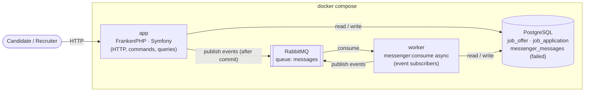
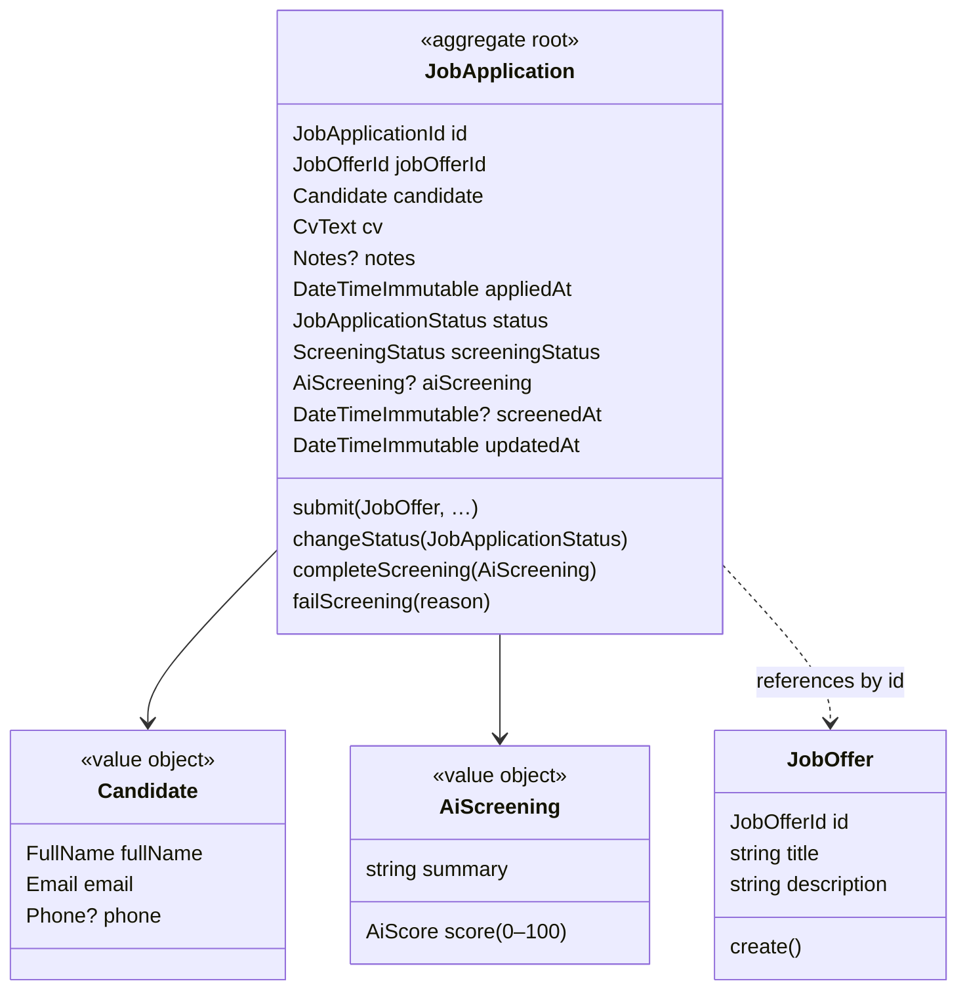
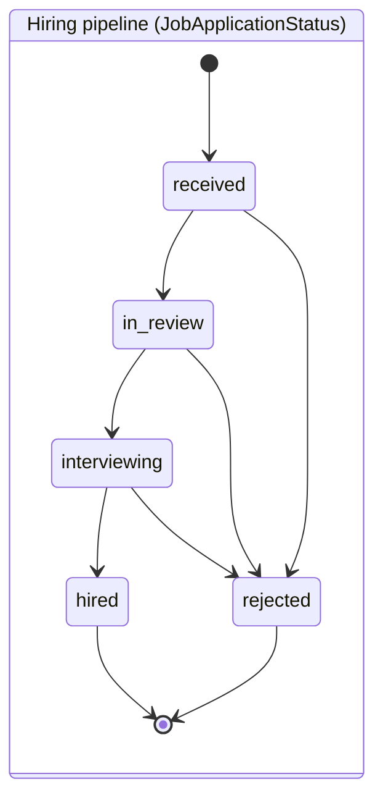
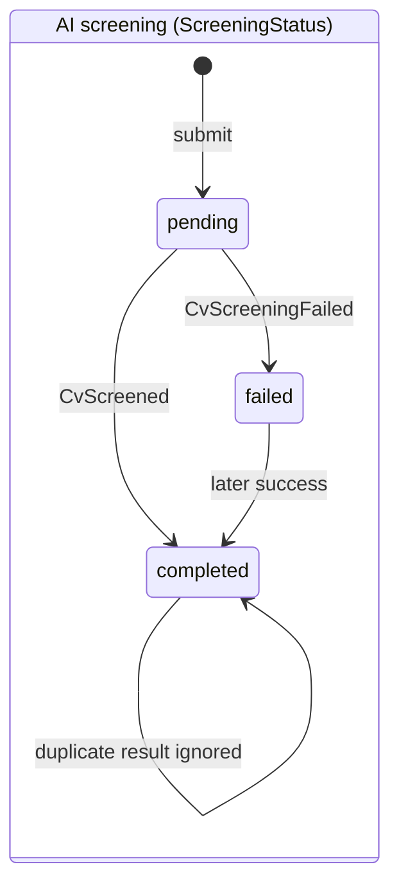
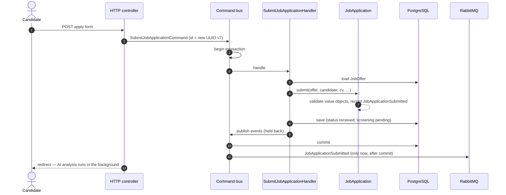
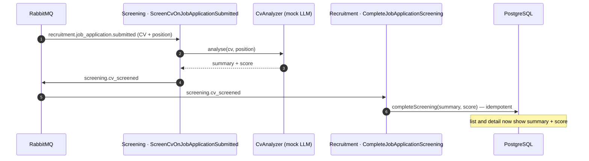
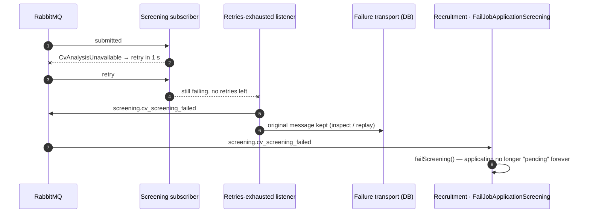
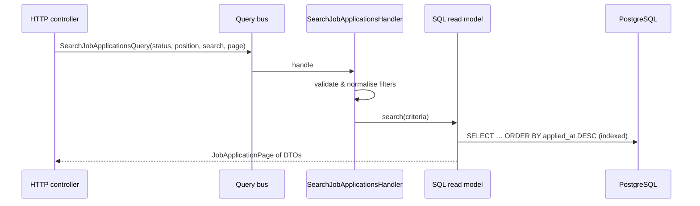

# Architecture

🇪🇸 [Versión en español](ARCHITECTURE.es.md)

This document explains **how the application is organised and why**, compared with the classic Symfony layout (`Controller/`, `Entity/`, `Repository/`, `Service/`), and gives a general map of the system: runtime pieces, domain model, use cases and the flows between them. The reasoning behind each individual choice lives in the [decision log](PLAN.md#decision-log).

## Contents

1. [The idea in one sentence](#the-idea-in-one-sentence)
2. [System at a glance](#system-at-a-glance)
3. [Folder layout](#folder-layout)
4. [Classic Symfony → this project](#classic-symfony--this-project)
5. [Bounded contexts](#bounded-contexts)
6. [Domain model](#domain-model)
7. [Use cases (CQRS)](#use-cases-cqrs)
8. [Flows](#flows)
9. [Contracts between contexts](#contracts-between-contexts)
10. [Reliability](#reliability)
11. [Persistence](#persistence)
12. [Testing strategy](#testing-strategy)
13. [Enforced, not just drawn](#enforced-not-just-drawn)
14. [Beyond the brief](#beyond-the-brief)
15. [Trade-offs and next steps](#trade-offs-and-next-steps)

## The idea in one sentence

In a classic Symfony app **the framework sits in the centre** and business rules are spread inside it (ORM attributes on entities, services using the `EntityManager`, validation attributes on entities). Here it is inverted: **business rules sit in the centre, in plain PHP, and Symfony, Doctrine and RabbitMQ are plugs at the edge**.

The rule that holds everything together: **dependencies only point inwards**. The domain doesn't know Symfony exists; Symfony knows the domain. This is verified automatically by Deptrac (`make deptrac`), so it is a guarantee, not a convention.

```
┌──────────────────── Infrastructure ────────────────────┐
│  HTTP controllers, Doctrine, RabbitMQ, Twig, AI mock    │
│    ┌─────────────── Application ───────────────┐        │
│    │  Use cases: SubmitJobApplication, …       │        │
│    │    ┌───────────── Domain ─────────────┐   │        │
│    │    │  JobApplication, Email, rules …  │   │        │
│    │    └──────────────────────────────────┘   │        │
│    └───────────────────────────────────────────┘        │
└─────────────────────────────────────────────────────────┘
                 dependencies point → inwards
```

## System at a glance

Four containers, one codebase. The web app and the worker run the **same image**: the app answers HTTP requests, the worker consumes RabbitMQ messages. Anything slow (the AI enrichment) happens in the worker, never inside a request.

Two audiences: **candidates** use the public pages (job offers, apply) without an account; **recruiters** sign in to see and manage applications. Authentication is handled entirely at the edge (Symfony Security); the domain and the use cases know nothing about users.



## Folder layout

```
src/
├── Recruitment/                        bounded context: job offers & applications
│   ├── Domain/                         plain PHP: rules and state
│   │   ├── JobApplication/             aggregate, value objects, statuses, events, repository port
│   │   │   ├── Candidate/              FullName, Email, Phone, Candidate
│   │   │   └── Event/                  JobApplicationSubmitted, …Screened, …StatusChanged, …
│   │   └── JobOffer/                   JobOffer, JobOfferId, repository port
│   ├── Application/                    one folder per use case (command/query + handler)
│   │   ├── SubmitJobApplication/
│   │   ├── ChangeJobApplicationStatus/
│   │   ├── CompleteJobApplicationScreening/   ← reacts to Screening's result
│   │   ├── FailJobApplicationScreening/       ← reacts to Screening's failure
│   │   ├── SearchJobApplications/             ← read side
│   │   ├── FindJobApplication/                ← read side
│   │   ├── ListJobOffers/                     ← read side
│   │   └── JobApplicationReadModel.php        read-side port
│   └── Infrastructure/
│       ├── Http/                       invokable controllers, apply form + request DTO
│       ├── Persistence/Doctrine/       repositories, XML mapping, DBAL types, schema listeners
│       ├── Persistence/Dbal/           SQL read models (query side)
│       └── Fixtures/                   demo data
├── Screening/                          bounded context: AI enrichment of CVs
│   ├── Domain/                         CvAnalyzer port, CvAnalysis, Position, events
│   ├── Application/ScreenCv/           subscriber + its own view of Recruitment's event
│   └── Infrastructure/
│       ├── Ai/                         FakeLlmCvAnalyzer (mocked LLM)
│       └── Messenger/                  "retries exhausted" listener
└── Shared/                             the minimum common to all
    ├── Domain/                         AggregateRoot, DomainEvent, DomainError, Uuid, bus ports
    └── Infrastructure/                 Messenger bus adapters, JSON event serializer, DBAL helpers, login
```

### Domain — the core

Business rules and nothing else: an email must be valid, an application can't jump from `received` to `hired`, a repeated AI result is ignored. No `Symfony\…` or `Doctrine\…` imports.

*Why:* rules are the most valuable and longest-living part of the code. In plain PHP they are tested in milliseconds without booting a kernel or a database, and framework upgrades don't touch them (this project moved from Symfony 7.4 to 8.1 without changing a single domain line).

### Application — the use cases

Each thing the system can do is a pair of classes: a command/query (input data) and its handler (orchestration). Handlers contain no business rules: they load or create aggregates, call their behaviour, save them and publish their events.

*Why:* like classic `Service` classes, but one responsibility each and named after the business. Reading the folder tells you what the application does. Handlers implement our own interfaces, not Messenger's, so use cases don't depend on the framework either.

### Infrastructure — the adapters

Everything technology-specific: HTTP controllers, Doctrine repositories and XML mapping, SQL read models, message serialization, the AI mock, fixtures, templates.

*Why:* replacing PostgreSQL, RabbitMQ or the AI provider only touches this folder.

## Classic Symfony → this project

| Classic Symfony | Here | What changes |
|---|---|---|
| `Entity/JobApplication.php` with `#[ORM\Column]` | `Domain/…/JobApplication.php` + XML mapping in `Infrastructure/Persistence/Doctrine/Mapping` | Still Doctrine — the metadata just moves out of the class, so the entity stays clean. |
| `Repository/…Repository extends ServiceEntityRepository` | Interface in `Domain` + `Doctrine…Repository` in `Infrastructure` | The domain declares *what* it needs (a **port**); infrastructure decides *how* (an **adapter**) — hence "ports & adapters". |
| `#[Assert\Email]` on the entity | `Email::fromString()` value object (plus form/DTO validation at the edge) | The rule travels with the data: an invalid `Email` can't exist anywhere. |
| `$entity->setStatus('hired')` | `$application->changeStatus(JobApplicationStatus::Hired, $now)` | No setters: only business-named methods that protect the rules. State is readable (`public private(set)`) but not writable from outside. |
| `Service/ApplicationService.php` | `Application/SubmitJobApplication/…Handler.php` | One use case per class. |
| Repository method returning entities for a list page | `SearchJobApplications` query + SQL read model returning DTOs | Reads skip the domain model entirely. |
| `EventSubscriber` / `MessageHandler` with `#[AsMessageHandler]` | Class implementing `DomainEventSubscriber`, wired in `services.yaml` | Same Messenger underneath; the use case just doesn't know it. |
| `Controller/` | `Infrastructure/Http/` | Translates HTTP → command/query, nothing else. |
| API Platform State Processor / Provider | Command handler / Query handler | Same idea: API Platform processors and providers already are adapters around a use case. |

## Bounded contexts

`Recruitment` (applications, hiring pipeline) and `Screening` (analysing a CV with AI) speak different languages and change for different reasons. If one imported the other's classes they would become a single coupled block, so they **only communicate through events over RabbitMQ**, and Deptrac fails if either imports the other.

| Context | Owns | Publishes | Consumes |
|---|---|---|---|
| **Recruitment** | Job offers, job applications (candidate, CV, hiring status, AI results once received) | `recruitment.job_application.submitted` | `screening.cv_screened`, `screening.cv_screening_failed` |
| **Screening** | Nothing persistent: analysing a CV against a position through an AI port | `screening.cv_screened`, `screening.cv_screening_failed` | `recruitment.job_application.submitted` |
| **Shared** | Shared kernel only: aggregate/event base classes, `Uuid`, bus interfaces | — | — |

Screening is **stateless** on purpose: the result it produces belongs to the application, so it is stored once, in Recruitment.

## Domain model



An application lives two **independent** lifecycles: the hiring pipeline, driven by recruiters, and the AI screening, driven by the asynchronous enrichment. A recruiter can move an application to `in_review` before the AI has answered.





Rules the aggregate protects: transitions only along the pipeline (final states are final); a repeated screening result is ignored; a late failure never overrides a completed screening. Every change records a domain event.

## Use cases (CQRS)

**Commands** change state and return nothing; **queries** return data and change nothing. They travel on separate buses because their semantics differ: commands run inside a database transaction, queries can bypass the domain model, events may have zero or many subscribers.

| Kind | Use case | Triggered by | Result |
|---|---|---|---|
| Command | `SubmitJobApplication` | Candidate (apply form) | Application `received`, screening `pending`, `JobApplicationSubmitted` |
| Command | `ChangeJobApplicationStatus` | Recruiter | Status moved along the pipeline, `JobApplicationStatusChanged` |
| Command | `CompleteJobApplicationScreening` | Screening's `cv_screened` event | Summary + score attached, `JobApplicationScreened` |
| Command | `FailJobApplicationScreening` | Screening's `cv_screening_failed` event | Screening `failed`, `JobApplicationScreeningFailed` |
| Subscriber | `ScreenCvOnJobApplicationSubmitted` (Screening) | Recruitment's `submitted` event | Calls the AI port, publishes `CvScreened` |
| Query | `SearchJobApplications` | Applications page | Page of rows: newest first, filtered by status / position, searched by name / email |
| Query | `FindJobApplication` | Detail page | Everything incl. CV, AI outputs, timestamps and allowed next statuses |
| Query | `ListJobOffers` | Apply page, position filter | Job offer catalog |

Recruitment reacts to Screening's events by **translating them into its own commands**: the change then goes through the command bus like any other write (transaction, business rules, events).

## Flows

### Submitting an application (synchronous part)



### AI enrichment (asynchronous, in the worker)



### When the AI keeps failing



### Reading (query side)



No aggregates are loaded on the read side: there are no rules to protect when reading, so plain SQL into flat DTOs is simpler and faster.

## Contracts between contexts

Events crossing a context boundary travel as **JSON**, identified by a **stable event name**. That name plus the payload is the contract — not a PHP class.

```
headers: type: recruitment.job_application.submitted
body:    {"aggregateId": "…", "occurredOn": "…", "payload": {"jobOfferId": "…", "positionTitle": "…", "positionDescription": "…", "cv": "…"}}
```

- The **publisher** serializes its own event class.
- Each **consumer owns its own class** for the events it reads, with only the fields it needs (Screening's `JobApplicationSubmitted` ignores `jobOfferId`). The mapping *event name → consumer class* is explicit configuration, so the integration map of the system is readable in one place.
- **Consumer-driven contract tests** send every published event through the real serializer and check the consumer's class rebuilds it: a renamed field fails a test, not production.
- Only events that cross a boundary are routed to RabbitMQ; the rest stay in-process.
- **Event-carried state transfer**: `JobApplicationSubmitted` carries the CV and the position, so Screening never has to call Recruitment back.

## Reliability

| Concern | How it is handled |
|---|---|
| Reacting to data that was rolled back | Events are held back until the command's transaction commits. |
| Duplicate delivery (RabbitMQ is at-least-once) | The aggregate is idempotent: a repeated result or a late failure changes nothing. |
| Transient AI failures | Messenger retries 3 times with exponential back-off (1 s, 2 s, 4 s). |
| Permanent AI failures | When retries are exhausted, a `CvScreeningFailed` fact is published and the original message is kept in the failure transport (`messenger:failed:show` / `retry`). |
| Unknown or malformed message | Decoding fails explicitly instead of handling a half-read event. |
| Broker down right after a commit | **Not covered** (known trade-off): the event would be lost. A transactional outbox would close this gap. |

## Persistence

- **Mapping in XML** inside Infrastructure, so entities carry no ORM attributes (Doctrine ORM 3 removed YAML mapping).
- **Value objects** become columns through custom DBAL types (`Email`, `FullName`, ids…); `Candidate` and `AiScreening` are embeddables (`candidate_*`, `ai_*` columns). Doctrine cannot express a *nullable* embeddable, so a small `postLoad` listener turns an all-NULL `AiScreening` back into `null`.
- **Aggregates reference each other by id** (an application stores `jobOfferId`, not a Doctrine association), so there is no foreign key between them; integrity is checked by the use case.
- **Indexes** for the list: `(applied_at, id)` for newest-first ordering, `status` and `job_offer_id` for the filters, and `pg_trgm` GIN indexes for the name/email "contains" search. The GIN indexes are declared to Doctrine by a schema listener so migrations never try to drop them.
- **Ids are UUID v7**: generated by the caller before dispatching a command (commands return nothing) and naturally time-ordered.

## Testing strategy

| Level | What it proves | How |
|---|---|---|
| Unit | Business rules, use-case orchestration, mock-LLM scoring, serializer | Plain PHPUnit, Object Mothers, in-memory repositories, spy buses. No kernel, no DB — milliseconds. |
| Integration | Adapters work for real: Doctrine round-trips, SQL read models, indexes, buses | PostgreSQL test database; every test rolled back (dama/doctrine-test-bundle); data seeded with Foundry through domain behaviour. |
| Contract | Each consumer can read what each publisher sends | Real JSON serializer, publisher class in → consumer class out. |
| End-to-end async | Submission → Screening → result, including retries and the failure path | A real Messenger `Worker` over the in-memory transport with serialization on. |

Every acceptance criterion of the brief (submission, enrichment, newest-first list with filters and search, detail) maps to at least one integration or end-to-end test.

## Enforced, not just drawn

| Rule | Checked by |
|---|---|
| Domain has no framework/ORM dependency | Deptrac |
| Application has no framework dependency | Deptrac |
| Contexts never import each other | Deptrac |
| Types are sound | PHPStan (level max) |
| Coding standard | PHP-CS-Fixer (`@Symfony`) |
| Business rules behave as specified | Unit tests (no kernel, no DB) |
| Adapters work with real PostgreSQL / Messenger | Integration tests |
| Contexts still understand each other's events | Contract tests |
| Recruiter area requires signing in; candidate pages stay public | Functional tests |
| All of the above on every pull request | GitHub Actions (`make qa`, `make test` inside Docker) |

## Beyond the brief

The brief asks for the apply → enrich → browse flow; the README lists the extras added on top. The one with an architectural angle is abuse protection.

**Abuse protection lives at the edge.** Every valid application costs a write and an AI analysis, so the apply form accepts at most `APPLY_RATE_LIMIT` (5) valid submissions per client IP every 15 minutes (sliding window, Symfony RateLimiter). Beyond that it answers `429` with `Retry-After` and keeps what the candidate typed; invalid submissions don't count, so a typo never locks a person out. The recruiter login is throttled the same way (5 failed attempts per minute for an email + IP pair).

Neither is a business rule, so neither touches the domain or the use case: the check happens in the HTTP controller before the command is dispatched, and another entry point (an API, a CLI) would set its own policy. A rule such as "one application per email and offer" would be different: that is business, and it would live in the domain.

**Applications from the same email are grouped on the read side.** A recruiter wants to see that a person has applied before, as real ATSs do. Each row of the list counts the applications sent from its email (linking to all of them) and the detail page lists the others. It is a query need, so it lives where CQRS puts queries: the read model (a correlated count and a second query, backed by an index on the email). The write model is unchanged: the candidate is still a value object inside each application.

The step not taken on purpose is promoting `Candidate` to an aggregate (its own id and table, applications referencing it, one candidate per email). **The email isn't verified**: grouping applications under one identity by email would let anyone attach an application, with their name, phone and CV, to someone else's profile, or overwrite it. That is why the UI says "from the same email address, which isn't verified" rather than presenting one person. See the next steps below.

## Trade-offs and next steps

Hexagonal architecture is not free: more files, more indirection, some mapping between layers. For a plain CRUD, a classic Symfony + API Platform approach is more productive. It pays off when business rules are rich, the code must live for years, or — as here — asynchronous flows between separate parts of the domain need clear boundaries.

What would change on the way to production:

- **Transactional outbox** so no event is lost if the broker is down right after a commit.
- **A real LLM adapter** implementing `CvAnalyzer` (prompting, JSON output parsing, timeouts, rate limits) — nothing else changes.
- **A projection table** for the list if reads and writes ever need to scale independently.
- **Accent-insensitive search** (`unaccent`) and keyset pagination for very large tables.
- **Internationalised emails** (non-ASCII local parts), currently rejected by the `Email` value object.
- **A real user store** (users table or SSO) instead of the in-memory demo recruiter account.
- **A `Candidate` aggregate, once the email is verified** (a confirmation link, or candidate accounts): its own id and table, applications referencing it by id, a unique email, a migration that merges today's duplicates, and a way for recruiters to merge or split profiles by hand. Until then, grouping stays on the read side (see [Beyond the brief](#beyond-the-brief)).
- **Rate limiting across instances**: the counters live in the app cache, so several app instances would share them through Redis, and behind a load balancer `trusted_proxies` must be set so the client IP is the real one.
