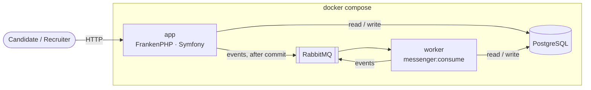
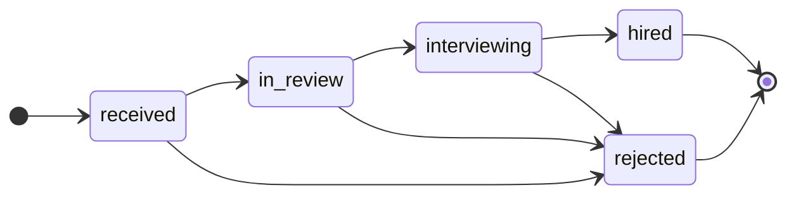
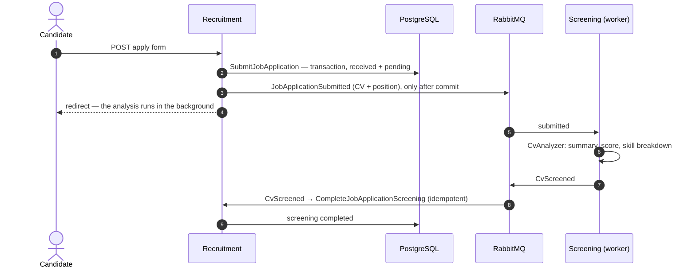

# Architecture

🇪🇸 [Versión en español](ARCHITECTURE.es.md)

How the application is organised and why. The reason behind each individual choice is in the [decision log](PLAN.md#decision-log).

## Overview

In a classic Symfony app the framework sits in the centre and business rules are spread inside it. Here it is inverted: **business rules sit in the centre, in plain PHP, and Symfony, Doctrine and RabbitMQ are plugs at the edge**. Dependencies only point inwards, and **Deptrac** fails the build otherwise; PHPStan (level max), PHP-CS-Fixer and the tests run in CI on every pull request.

Four containers, one codebase. The app and the worker run the **same image**: the app answers HTTP, the worker consumes RabbitMQ, so anything slow (the AI enrichment) never runs inside a request. Candidates use the public pages without an account; recruiters sign in (Symfony Security, entirely at the edge).



## Layers and contexts

```
src/
├── Recruitment/   job offers and applications
│   ├── Domain/          aggregate, value objects, events, repository ports — plain PHP
│   ├── Application/     one folder per use case: command or query + handler
│   └── Infrastructure/  controllers, Doctrine (XML mapping), SQL read models, fixtures
├── Screening/     AI analysis of CVs: the CvAnalyzer port and a mocked LLM
└── Shared/        minimal shared kernel: base classes, Uuid, pagination, bus interfaces, login
```

- **Domain**: the rules, with no `Symfony\…` or `Doctrine\…` imports, tested in milliseconds. The upgrade from Symfony 7.4 to 8.1 didn't touch it.
- **Application**: each use case orchestrates (load, call the aggregate, save, publish) and holds no rules. Handlers implement our own interfaces, not Messenger's.
- **Infrastructure**: everything technology-specific; replacing PostgreSQL, RabbitMQ or the AI provider only touches this layer.

| Context | Owns | Publishes | Consumes |
|---|---|---|---|
| **Recruitment** | Job offers, applications (candidate, CV, hiring status, AI results) | `job_application.submitted` | `cv_screened`, `cv_screening_failed` |
| **Screening** | Nothing persistent: analysing a CV against a position | `cv_screened`, `cv_screening_failed` | `job_application.submitted` |

The contexts never import each other's classes; they only talk through events. Screening is stateless: its result belongs to the application, so it is stored once, in Recruitment.

| Classic Symfony | Here |
|---|---|
| Entity with `#[ORM\Column]` | Plain class + XML mapping in Infrastructure |
| `ServiceEntityRepository` | Interface in Domain (port) + Doctrine implementation (adapter) |
| `#[Assert\Email]` on the entity | `Email` value object: an invalid one can't exist (forms still validate at the edge) |
| `setStatus('hired')` | `changeStatus(Hired, $now)`: business methods only, state readable but not writable from outside |
| Service class | One handler per use case; reads go through SQL straight into DTOs |

## Domain

`JobApplication` is the aggregate. It lives two independent lifecycles: the **hiring pipeline**, moved by recruiters, and the **AI screening** (`pending → completed | failed`), moved by the worker. A recruiter can move an application before the AI has answered.



- Transitions only along the pipeline; `hired` and `rejected` are final.
- **Idempotent screening**: a repeated result is ignored and a late failure never overrides a completed one (messages may arrive twice).
- Every change records a domain event; the handler publishes them.
- Persistence: value objects map to columns through custom DBAL types, `Candidate` and `AiScreening` are embeddables (the AI's skill breakdown is a JSON column), aggregates reference each other by id, and ids are UUID v7 chosen by the caller.

## Main flow



Recruitment turns Screening's events into its own commands, so every write goes through the same path (transaction, rules, events). If the AI keeps failing, Messenger retries 3 times and then `CvScreeningFailed` marks the screening as failed. Pages read through SQL straight into DTOs, without loading aggregates; the detail page polls only while the analysis is pending.

## Events and reliability

- Events crossing a context travel as **JSON identified by a stable name** (`screening.cv_screened`); that name and the payload are the contract, not a PHP class.
- Each consumer **owns its own class** with only the fields it needs; a map in `services.yaml` says which class reads each event.
- **Contract tests** send every event through the real serializer: a renamed field fails a test, not production.
- **Contracts evolve additively**: `cv_screened` gained `skills`, and an event without it still reads as "no breakdown".
- **Event-carried state**: `JobApplicationSubmitted` carries the CV and the position, so Screening never calls Recruitment back.

| Concern | How it is handled |
|---|---|
| Reacting to rolled-back data | Events wait for the command's transaction to commit |
| Duplicate delivery (at-least-once) | The aggregate ignores repeated results |
| Transient AI failure | 3 retries with back-off (1, 2, 4 s) |
| Permanent AI failure | `CvScreeningFailed` is published; the message stays in the failure transport to inspect or replay |
| Broker down right after a commit | **Not covered**: the event would be lost (see the outbox below) |

## Testing strategy

| Level | What it proves |
|---|---|
| Unit | Business rules, use cases (in-memory repositories, spy buses), mock-LLM scoring — no kernel, no database |
| Integration | Doctrine and SQL read models against real PostgreSQL, each test rolled back |
| Contract | Each consumer can read what each publisher sends |
| Asynchronous | A real Messenger worker: enrichment, retries and the failure path |
| Functional | Every page over HTTP, access control, and the whole journey from the form to the recruiter screens |

| Acceptance criterion | Proven by |
|---|---|
| Submitting creates a record with `appliedAt` and the default status | `ApplyToJobOfferTest`, `SubmitJobApplicationHandlerTest`, `JobApplicationTest` |
| Asynchronous enrichment adds summary and score | `AsyncEnrichmentTest`, `ApplicationJourneyTest`, `EventContractsTest` |
| …including when the AI fails | `AsyncEnrichmentTest` |
| The list is newest first, with the score | `SearchJobApplicationsTest`, `BrowseJobApplicationsTest` |
| Real-time filtering by status and position, search by name or email | `SearchJobApplicationsTest`, `BrowseJobApplicationsTest` |
| The detail shows all data, including the enrichment | `JobApplicationDetailTest`, `FindJobApplicationTest` |

## Beyond the brief

Added because a real recruiting tool would need them; none changes the required flows.

| Extra | What it adds |
|---|---|
| Recruiter login | Candidates apply without an account; reviewing applications requires signing in |
| Abuse protection | 5 valid applications per IP every 15 min (`APPLY_RATE_LIMIT`), login throttling |
| Hiring pipeline | Transitions guarded by the domain, inline confirmation to reject |
| Skill-by-skill match | ✓/✗ per skill the offer asks for, next to the offer itself |
| Grouping by email | How many applications came from each email, and the others on the detail page |
| Overview, sorting, pagination | Counts per status, KPIs, any column sortable, all in the URL |
| UI quality | Dark mode, keyboard and screen-reader friendly, works without JavaScript |

Two have an architectural angle. **Rate limiting is a channel concern, not a business rule**, so it lives in the controller and the domain is untouched. **Grouping by email lives on the read side only**: the email isn't verified, so turning `Candidate` into an aggregate (one identity per email) would let anyone attach an application to someone else's profile.

## Trade-offs and next steps

Hexagonal architecture costs files and indirection; for a plain CRUD, classic Symfony with API Platform would be more productive. It pays off with rich rules, long-lived code or, as here, asynchronous flows between separate parts of the domain. On the way to production:

- **Transactional outbox**, so no event is lost if the broker is down right after a commit.
- **A real LLM adapter** for `CvAnalyzer` (prompt, JSON output validation, timeouts); nothing else changes.
- **A `Candidate` aggregate**, once the email is verified.
- **Search**: accent-insensitive (`unaccent`), keyset pagination for very large tables, a projection table if reads and writes scale apart.
- **Several app instances**: sessions and rate-limit counters in Redis, `trusted_proxies` behind the load balancer.
- **Operations**: restart the worker on every deploy (`messenger:stop-workers`) with migrations compatible with the running version, and alert when the failure transport isn't empty.
- **Users**: a real user store instead of the in-memory demo recruiter; internationalised emails.
